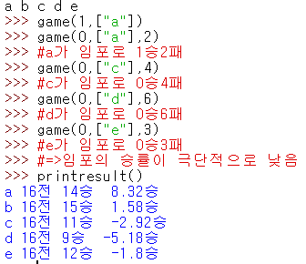

# Introduction
비대칭적인 게임의 진행결과로 공정한 지표를 만드는 프로젝트

(Legacy created in 2021)

친구들과 어몽어스를 하다가, 임포스터 팀과 시민 팀의 승률이 비대칭적이라고 느껴 이를 보정한 지표를 만들고자 하였다. (즉, 게임 밸런스가 완벽하지 않다는 가정하에서 누가누가 잘했나를 평가해보자는 것)

이는 임포스터와 시민이 나눠진 어몽어스, 마피아와 시민이 나눠진 마피아게임, 경찰과 도둑이 나눠진 경도, 선공과 후공이 나눠진 모든 게임, 블루 진영과 레드 진영이 나눠진 롤 등 비대칭적인 요소가 있는 모든 게임에 적용할 수 있다.

# Theoretical Background
베이지안 통계학의 관점에서, 임포스터와 시민의 승률을 추정하여 이 승률을 이용하여 지표를 만들었다.

사전분포 및 사후분포를 확률 값에 대한 켤레 사전분포인 Beta Distribution을 사용하였으며, 초기 parameter는 무정보 사전분포에 해당하는 1, 1을 사용하였다. 이 값은 프로그램에서 수정할 수 있으며, 이를 통해 자신이 설정한 게임이 얼마나 공정한 게임인지에 관한 믿음을 표출하는 사전분포를 설정할 수 있다(!).

본인은 친구들이 설정한 어몽어스 규칙이 별로 안공정한 것 같아서 무정보 사전분포를 사용했다..

보정 지표에 사용되는 값은 0.5/(베이즈 추정량)을 더해주거나 빼주며, 이는 승률이 0.5일 떄 승점을 1점씩 주고 받는 것을 기준으로, 승률이 0.5와 다를 때는 이때의 0.5인 경우에 비교하여 얼마나 더 승리하기 쉬웠거나 어려웠는지에 대한 값을 곱해주어 보정해주었다. 이는 곧 승리하기 2배 어렵다면 승리 시 2배의 승점을 얻는 것이다. 최종적으로 승점의 경우 합이 0이 되도록 한다.

# How to use

Python의 Interactive Shell(대화형 쉘)을 사용하는 것을 추천한다. 그 이유는 UI를 만들기 귀찮았기 때문,,

1. main.py를 import한다

2. 초기화 과정 - player의 이름을 띄어쓰기로 한줄에 넣어준다. (ex. "player1 player2 player3 player4 player5")

3. 게임을 진행하여 결과를 입력하고 변경할 내용이 있으면 수정한다. 

- 게임 결과 입력: game(1, ["player1", "player2"], weight=1) - 1은 임포스터 승리, 0은 시민 승리, 뒤의 리스트는 임포스터 명단, weight는 이번 게임의 비중(미기재시 1)

- 규칙이 변경되었을 떄 : changerule()

- 새로운 사람이 왔을 때 : plus("player6")

- 기존 사람이 나갔을 때 : minus("player1")

4. 결과를 확인한다 - printresult()

# Example

한쪽의 승률이 극단적일 경우에 위와 같이 승수가 더 적음에도 더 좋은 지표를 얻는 모습을 볼 수 있다!

